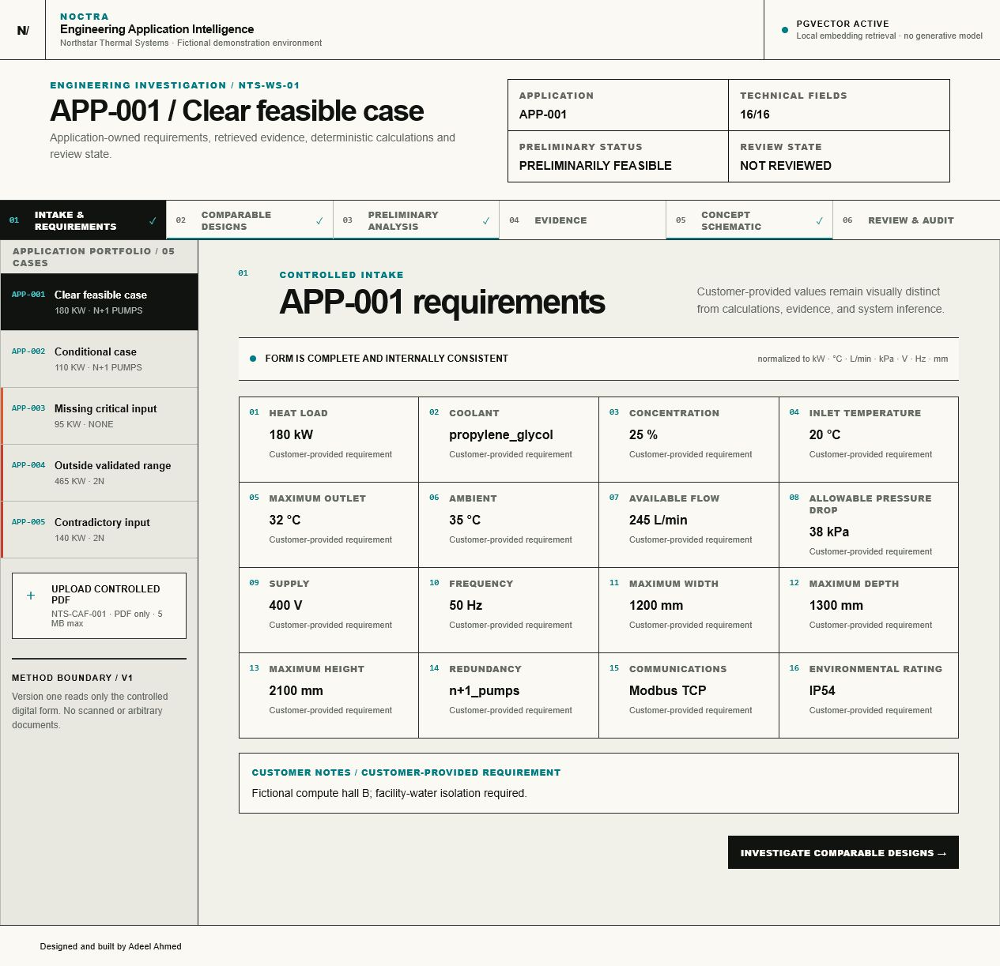
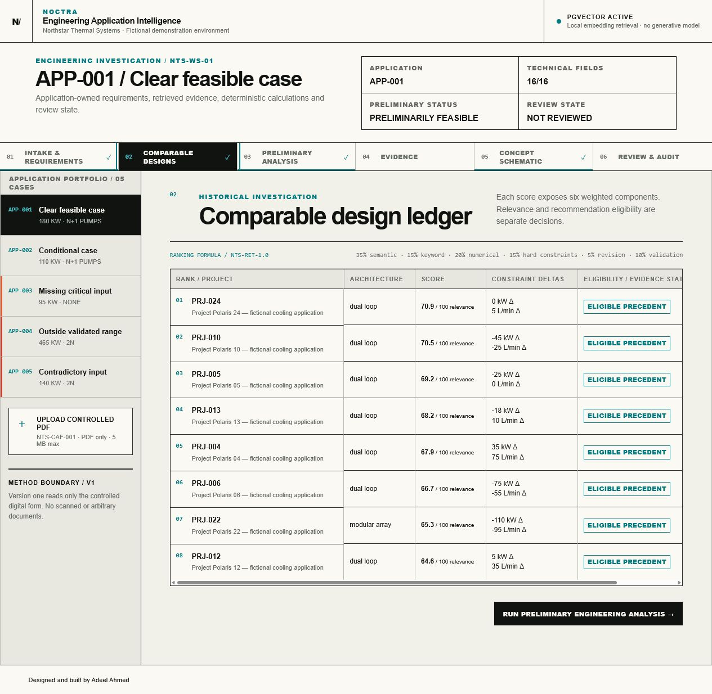
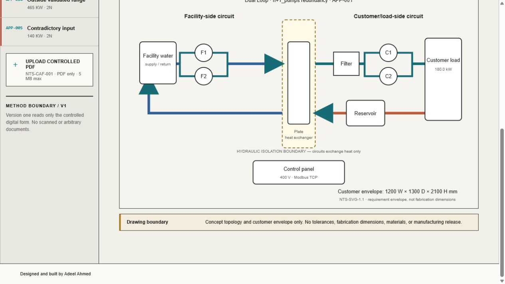

# Engineering Application Intelligence

An evidence-grounded preliminary design workspace. **Northstar Thermal Systems** appears only as fictional demonstration content for an invented industrial liquid-cooling company.

> **Fictional demonstration and engineering boundary:** All engineering data, organizations, customers, products, projects, source documents, part identifiers, values, and outcomes are fictional. This application is not certified engineering software. Every output is preliminary and requires qualified human review. No employer systems or real customer data are connected.

The controlled workflow extracts a standardized PDF application sheet, validates and normalizes requirements, retrieves traceable evidence, ranks comparable fictional projects with an exposed score breakdown, runs deterministic calculations, composes a cited assessment from controlled templates, generates a parameter-driven SVG concept, and gates local audit-recorded review decisions.

No OpenAI, Anthropic, Gemini, hosted model API, hosted embedding service, remote LLM, or local generative LLM is used. The pinned Apache-2.0-licensed `Xenova/all-MiniLM-L6-v2` ONNX model creates 384-dimensional, normalized mean-pooled embeddings locally in the browser. It retrieves evidence; it does not generate engineering conclusions. The SVG is a **preliminary concept — not a manufacturing drawing**.

## Final workspace

- `frontend/` — Next.js App Router, React, strict TypeScript, bundled ONNX/WASM query embedding, responsive application-scoped workspace
- `backend/` — FastAPI, strict schemas, deterministic extraction, validation, calculation, ranking, assessment, SVG, review, and audit services
- `data/` — 41 fictional source records, five controlled application fixtures, versioned material/rule tables, evaluation questions, PDFs, and genuine embeddings
- `scripts/` — fixture generation, embedding, PostgreSQL seeding, retrieval evaluation, and system/security/network validation
- `docs/` — architecture, methodology, governance, API, security, validation evidence, limitations, and screenshots

PostgreSQL 16 with pgvector 0.8.6 has been validated in practice using the pinned localhost-only Compose service. The repository stores and checks model ID, exact revision, dimensions, pooling, and normalization metadata alongside the vectors. A configured but unavailable or incompatible PostgreSQL instance fails clearly; it never silently falls back. When no database is configured, the visibly labeled `compatibility_file_vector` mode remains available using the same genuine stored embeddings and exact cosine math.

## Local startup and shutdown

Requirements: Node.js 20+, npm, Python 3.11–3.14, Docker Desktop using Linux containers through WSL 2, and the bundled local model files.

Create an uncommitted `.env` from `.env.example`, use a strong local-only database password, then start the preserved database and services:

```powershell
$env:POSTGRES_PASSWORD = Read-Host "Local PostgreSQL password"
docker compose up -d postgres
$env:DATABASE_URL = "postgresql://cooling_app:<local-password>@127.0.0.1:5432/cooling_intelligence"
$env:RETRIEVAL_MODE = "postgresql"
python -m uvicorn backend.app.main:app --host 127.0.0.1 --port 8000
npm --prefix frontend run dev -- --hostname 127.0.0.1
```

Open `http://127.0.0.1:3000`. Service discovery is at `http://127.0.0.1:8000/`, health at `/api/v1/health`, the self-hosted interactive API reference at `/docs`, and the schema at `/openapi.json`.

Stop the application processes first, then preserve the named database volume while stopping PostgreSQL:

```powershell
docker compose stop postgres
docker desktop stop
```

The model is bundled under `frontend/public/models/all-MiniLM-L6-v2/`, ONNX Runtime WASM is local under `frontend/public/wasm`, and runtime remote downloads are disabled. See [model provenance](docs/model-provenance.md) and [PostgreSQL validation](docs/postgresql-validation.md).

## Governance behavior

- `Approve for concept review` is permitted only when the preliminary state satisfies the review gate.
- Approval is prohibited for missing-critical-information, contradictory, and outside-validated-range applications.
- `Return for additional information` and `Reject preliminary configuration` remain available with a valid reviewer note where allowed.
- Every permitted action records exactly one idempotent local audit event with application, architecture, evidence, calculation version, state transition, reviewer note, and idempotency key.
- Failed and superseded sources remain readable as evidence only and can never be recommended as a starting configuration.

## Validation snapshot

The final local gate runs the complete backend and live PostgreSQL integration suites, frontend race/regression suite, ESLint, strict TypeScript, production build, retrieval evaluation, citation/provenance validation, and secret/runtime-network scans. Current retrieval metrics are recorded in [evaluation-results.json](docs/evaluation-results.json): Recall@8 `1.0000`, Precision@8 `0.21875`, MRR `0.65327`, correct-current-revision `1`, citation validity `1.0000`, and unsupported claims `0`.

## Portfolio views







## Product boundaries

- Version one supports only the controlled `NTS-CAF-001` standardized digital PDF form; it does not claim universal document understanding.
- Thermal and hydraulic calculations are deliberately simplified portfolio demonstrations.
- Retrieval relevance is not engineering approval.
- The concept SVG has no fabrication dimensions, tolerances, GD&T, or CAD semantics.
- Review decisions remain in the local fictional application; there are no emails, telemetry, analytics, external writes, or connected employer/customer systems.

See [architecture](docs/architecture.md), [engineering methodology](docs/engineering-methodology.md), [retrieval methodology](docs/retrieval-methodology.md), [API](docs/api.md), [security](docs/security.md), [evaluation](docs/evaluation.md), and [limitations/roadmap](docs/limitations-and-roadmap.md).
