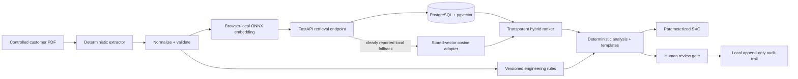

# Architecture and data flow

Product context is deliberately separated: **Noctra** is a provisional umbrella identifier, **Engineering Application Intelligence** is the product, and **Northstar Thermal Systems** is fictional demonstration content only.

Trust boundaries: uploaded bytes are untrusted and limited by type/size; extracted text is treated as data; the browser embedding runtime cannot fetch remote models; the API is loopback-bound with restricted CORS; local PostgreSQL is a separate persistence boundary; human review is the final decision boundary.

The local PostgreSQL 16 + pgvector 0.8.6 path has been exercised end to end on the target Windows laptop through Docker Desktop's WSL 2 Linux-container backend. Query embeddings are generated by the bundled browser-local ONNX/WASM runtime; engineering conclusions remain deterministic Python calculations and controlled templates.

For local browser compatibility, Next.js same-origin `/api/v1/*` routes reverse-proxy to the loopback FastAPI service. `NEXT_PUBLIC_API_URL` can explicitly select a reviewed deployment URL later.

Material claims carry source IDs. Calculations cite the rule/constant source and calculation version. Recommendation eligibility is separate from relevance.

Controlled schematic topology definitions:

- `single_loop`: one shared customer cooling circuit with no hydraulic-isolation heat exchanger.
- `dual_loop`: separate facility-side and customer/load-side circuits that exchange heat only across a plate heat exchanger.
- `modular_array`: a facility header serving parallel isolated cooling modules with distinct customer branches.

These definitions are versioned in `data/engineering_rules.json` and cite fictional `MAN-THERM-002`.
